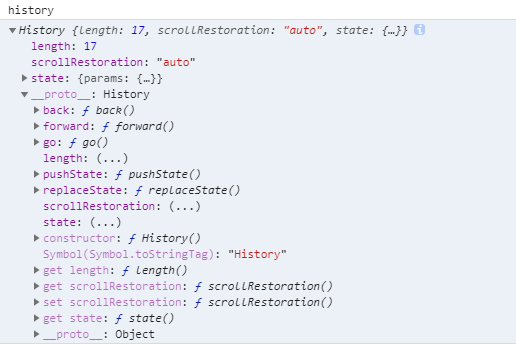

### JavaScript

#### <script\>`async`和`defer`属性和区别


**警告：**

>* 多个`async`属性或`defer`脚本在现实当中，并不一定会按照顺序执行。因此确保两者之间互不依赖非常重要。
>* `defer`属性脚本在现实当中，不一定会在`DOMContentLoaded`事件触发前执行，因此最好只包含一个延迟脚本。

#### 八进制、十进制、十六进制表示法
```js
//八进制的56 八进制之字面值的第一位必须时零(0)
const ocatalNum = 070  
// 整数 十进制 55
const intNum = 55
//十六进制的 31   十六进制字面值的前两位必须时0xr't
const hexNu = 0x1f 
```

#### 一元加操作符

一元加操作符，放在数值前面，对数值不会产生任何影响。
```js
let num = 25;
num = +num; //仍然时25
```
**不过在对非数值应用一元加操作符时，该操作符会像Number()转型函数一样对这个值执行转换。**
>* 布尔值false 和 true 将被转换为0和1
>* 字符串会被按照一组特殊的规则进行解析
>* 对象时先调用它们的valueOf() 和 toString() 方法，再转换得到的值
```js
const num1 = +'01'; // 数值 1
const num2 = +"1.1"; //   1.1
const num3 = +'z';   // NaN
const num4 = false // 0
const num5 = true // 1
const o = +{valueOf:function(){return -1}}; // -1
```

#### 原码 反码 补码

#### Event Loop

#### History API
在History API出现之前，我们没有办法使用js代码操作会话记录的前进后退。History API的出现使我们拥有了操作浏览器会话历史纪录的能力，通过`History API`接口改变当前会话路径，不会引起浏览器重新请求。通过访问`window.history`来操作会话记录。下面实在chrome控制台输出的history对象。

**history.length** : 会话历史中元素的数量。
**hisotry.back()** : 前往上一页，等价于**history.go(-1)**。当处于最开始一页时，执行没有效果，不会报错。
**hisotry.forward()** : 前往下一页，等价于**history.go(1)**。当处于最后一页时，执行没有效果，不会报错。
**history.go()** :参数为-1时为前往上一页，1时为前往下一页。当参数超出会话历史记录界限时，执行没有效果，不会报错。
```js
history.go(-1) //后退1页
history.go(1)  //前进1页
history.go(2)  //前进2页
history.go("/abc/test") //去最近的 /abc/test 页  可能是前进 也可能是后退
```
**history.pushState()** : 添加一条新的会话记录到会话栈里。
```js
// pushState 参数如下：
// history.pushState(state,title,url);
// state : Object 新会话记录的状态信息，我们可以从当前会话里传一些数据给新的会话记录使用。
// title : String 新会话记录的标题
// url   : String 新会话记录的URL(路径)

//例如：
history.pushState({userId:123123},'','/user');
//我们可以在history.state 中取到 {userId:123123}
```

**history.replaceState()** : 创建一个新的会话来替换当前的会话。
```js
// replaceState 参数如下：
// history.replaceState(state,title,url);
// state : Object 新会话记录的状态信息，我们可以从当前会话里传一些数据给新的会话记录使用。
// title : String 新会话记录的标题
// url   : String 新会话记录的URL(路径)

//例如：
history.replaceState({userId:123123},'','/user');
//我们可以在history.state 中取到 {userId:123123}
```

**最重要的内容** `window.onpopstate`事件
当用户点击浏览器前进，后退按钮 或者，调用`history.go()` `history.forward()` `history.back()` 才会触发这个事件。
此外请注意，`history.pushState()`及`history.replaceState()`本身调用时是不触发popstate事件。


