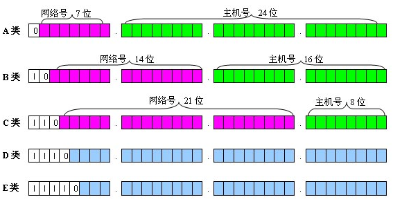

### IP地址分类

A类地址：0.0.0.0~127.0.0.0，主机地址为后24位。因此一个网段内可容纳主机地址上限为16,777,214个。

B类地址 ：128.0.0.1 ~ 191.255.0.0，主机地址为后16位，上限为65,534个。

C类地址：192.168.0.0 ~ 239.255.255.0。主机地址为后8位，上限位254个。

### 广播地址

主机地址全部设置为1，就成了广播地址。使用广播地址发送数据，会被所有该网段主机收到。

### 私有地址

10.0.0.0    ~ 10.255.255.255  (10/8)       A类

127.16.0.0  ~ 127.31.255.255  (127.16/12)  B类

192.168.0.0 ~ 192.168.255.255 (192.168/16) C类

